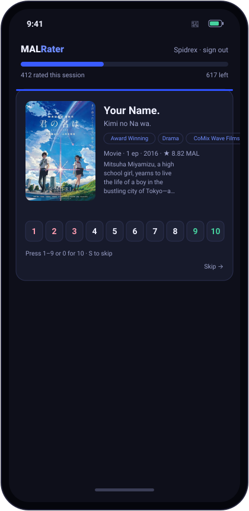

# MAL Rater 🎬

Bulk-rate your **MyAnimeList** backlog — fast. Connect your MAL account and MAL Rater
shows every anime you've *completed but never scored*, one at a time, with its cover and
synopsis. Press **1–10** and the rating saves straight to MyAnimeList and jumps to the
next. Clear a backlog of hundreds in minutes.

**Live:** https://mal-rater.danmat.workers.dev

<p align="center"></p>

- ⌨️ **Keyboard-first** — `1`–`9` to score, `0` for 10, `S` to skip. Auto-advances.
- 🔒 **Official MAL OAuth** — you log in on MyAnimeList; it never sees your password and
  writes only to your own list.
- 🖼️ Cover, English + original title, synopsis, genres — straight from the MAL API.
- 💾 Progress persists (and every rating is already saved to MAL).
- 🆓 Free, no tracking. Runs on a single Cloudflare Worker (+ KV for sessions).

## How it works

A Cloudflare Worker serves the UI and handles MyAnimeList OAuth2 (PKCE). It reads your
completed-but-unrated list from the official MAL API, and `PATCH`es each score back. Card
art/synopsis come from the MAL API too (Jikan is a fallback). Session tokens live in KV.

## Self-host

```bash
pnpm install
npx wrangler kv namespace create TOKENS   # put the id in wrangler.toml
```

1. Register a MAL API app at [myanimelist.net/apiconfig](https://myanimelist.net/apiconfig)
   (App type **web**, Redirect URL `https://<your-worker>/oauth/callback`).
2. Set the secrets:
   ```bash
   npx wrangler secret put MAL_CLIENT_ID
   npx wrangler secret put MAL_CLIENT_SECRET
   ```
3. `npx wrangler deploy`

## Privacy

MAL Rater stores only an OAuth session token (in Cloudflare KV, keyed by a cookie) so it
can save your ratings. It never sees your password and writes only to your own list.
